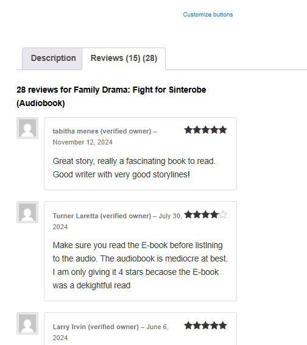

# Before & After: Unified Reviews Demo

This document visually demonstrates the impact of the WooCommerce Unified Reviews customization.

---

## 📉 Before

- Each product format (paperback, ebook, audiobook) showed **separate reviews**.
- Tab labels often displayed `Reviews (0)` even when reviews existed.
- Product summary showed mismatched counts (e.g., "0 reviews" with visible reviews).
- Structured data (schema.org) reported incorrect counts to Google.

**Screenshots:**
- 

---

## 📈 After

- Reviews are **aggregated across grouped formats**.
- Tab labels now show the **correct combined count** (e.g., `Reviews (50)`).
- Product summary displays accurate stars and counts.
- Structured data override ensures Google sees the correct review count.

**Screenshots:**
- 
- 

---

## 🎯 Impact

- **Customer trust:** Shoppers see consistent feedback across formats.
- **Conversion boost:** More visible reviews increase purchase confidence.
- **SEO improvement:** Google search results now display correct ratings and counts.
- **Portfolio value:** Demonstrates advanced WooCommerce customization, template overrides, and SEO‑aware development.
